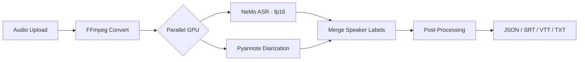
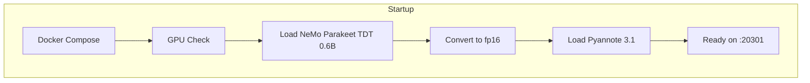

# MVP-Echo Scribe

GPU-accelerated audio transcription with speaker diarization. Two days of exhaustive benchmarking across two ASR engines, multiple GPU optimization strategies, and dozens of dependency fixes to find the fastest, leanest configuration possible.

**Live**: [scribe.mvp-scale.com](https://scribe.mvp-scale.com)

## Results

RTX 3090, 18-minute two-speaker podcast:

| Configuration | Time | VRAM | Notes |
|--------------|------|------|-------|
| **NeMo fp16 + parallel diarization** | **20s** | **4 GB** | Production config. Best quality. |
| NeMo fp32 (baseline) | 15s | 15 GB | Faster but 3.7x more VRAM |
| Sherpa-ONNX int8 + parallel diarization | 26s | 14 GB | Fast raw ASR, weak segmentation |
| Sherpa-ONNX + built-in diarization (CPU) | 2 min | 3 GB | Diarization bottleneck |
| Sherpa-ONNX + built-in diarization (GPU) | 4.5 min | 3 GB | GPU 2.3x slower than CPU |
| Sherpa-ONNX VAD + WebSocket hybrid | >2 min | 4 GB | 75+ sequential round-trips |

NeMo fp16 is the winner. 73% VRAM reduction (15GB to 4GB) opens deployment to 8GB consumer GPUs with no quality loss.

## Quick Start

```bash
# Prerequisites: NVIDIA GPU (8GB+), Docker, nvidia-container-toolkit
# HuggingFace token required for Pyannote gated model

git clone <repo-url> && cd mvp-echo-studio
echo "HF_TOKEN=hf_your_token_here" > .env
./scripts/start.sh nemo

# Open http://localhost:20301
# Or: curl -X POST -H "Authorization: Bearer $API_KEY" \
#   -F "file=@audio.mp3" -F "diarize=true" \
#   -F "response_format=verbose_json" http://localhost:20301/v1/audio/transcriptions
```

First startup downloads ~8GB of models (cached in Docker volume).

## How It Works





## What We Tried — The Full Optimization Log

This wasn't a single test. It was a systematic, phased approach to squeeze every millisecond and megabyte out of the pipeline.

### Phase 1: Baseline (Feb 9)

- [x] NeMo Parakeet TDT 0.6B working on RTX 3090
- [x] Pyannote speaker-diarization-3.1 for speaker labels
- [x] 17 min audio in ~15s, ~6GB VRAM
- [x] RTF 0.015 (67x faster than real-time)
- [x] Full feature set: paragraphs, entity detection, sentiment, text rules, SRT/VTT export
- [x] torchaudio ABI shim created (NVIDIA's custom PyTorch breaks all PyPI wheels)

### Phase 2: Hexagonal Architecture (Feb 10, morning)

- [x] Ports-and-adapters pattern: `TranscriptionPort`, `DiarizationPort`, `AudioProcessingPort`
- [x] Infrastructure ports: `JobQueuePort`, `RateLimiterPort`, `ProgressPort`, `KeyStorePort`, `UsagePort`
- [x] NeMo adapter extracted from monolithic api.py
- [x] Pyannote adapter shared across engines
- [x] FFmpeg adapter shared across engines
- [x] Engine selection via `ENGINE=nemo|sherpa` env var
- [x] `TranscribeAudioUseCase` orchestrates full pipeline via dependency injection

### Phase 3: Sherpa-ONNX — Can We Go Faster? (Feb 10, afternoon)

**Attempt 1: Sherpa built-in diarization (GPU)**
- [x] `OfflineSpeakerDiarization` with Pyannote segmentation 3.0 + CAM++ embeddings
- [x] Tested native C++ binary v1.12.24 — not a Python issue
- [ ] **FAILED**: GPU diarization 4 min 26s vs CPU 1 min 55s (2.3x slower)
- [x] Root cause: segmentation model (5.7MB) + embedding model (27MB) too small for GPU transfer overhead
- [x] **Conclusion: Building from source won't fix this. Architecture is GPU-hostile.**

**Attempt 2: VAD + WebSocket hybrid**
- [x] Silero VAD → speech segments → GPU WebSocket server for ASR
- [ ] **FAILED**: 75+ sequential network round-trips per file
- [x] Total time worse than NeMo baseline
- [x] **Conclusion: Network serialization kills throughput for many small segments.**

**Attempt 3: Sherpa batch GPU ASR + Pyannote diarization**
- [x] `OfflineRecognizer.from_transducer()` with `decode_streams()` batch API
- [x] 80s sub-chunks fit encoder attention window (1250 frames at 12.5 fps)
- [x] ASR: 5-10s for 18 min (fast)
- [x] Pyannote via PyTorch (not Sherpa built-in) for quality diarization
- [x] **Working** — but total still ~35s due to sequential execution

**Attempt 4: Eliminate outer chunking**
- [x] Removed 500s use-case-level chunking (NeMo holdover)
- [x] Full audio → Sherpa in one file → 13 internal 80s sub-chunks → single batch decode
- [x] ASR dropped from 29s (3 sequential batches) to 11s (1 batch)
- [x] **Result: 35s → 26s**

**Attempt 5: Parallel diarization + ASR**
- [x] `ThreadPoolExecutor(max_workers=2)` — both release GIL during GPU kernels
- [x] Sherpa (ORT) + Pyannote (PyTorch) use independent CUDA allocators
- [x] Diarization (12s) fully hidden behind ASR (11-24s)
- [x] **Result: Sequential 35s → parallel 26s**

**Attempt 6: ORT CUDA arena reduction**
- [x] `ORT_ARENA_EXTEND_STRATEGY=kSameAsRequested` env var set
- [x] Verified env var reaches container
- [ ] **Minimal impact**: VRAM still ~14GB. ORT configures arena via C++ SessionOptions, may ignore env var.

**Attempt 7: Finer segment granularity for diarization accuracy**
- [x] Reduced `SEGMENT_SILENCE_THRESHOLD` from 0.5s to 0.25s
- [x] Added `MAX_SEGMENT_DURATION` cap at 6s
- [x] Segments jumped from 43 to 468 for 17 min audio
- [x] Better speaker assignment in merge step
- [ ] **Still not as good as NeMo's native sentence boundaries**

**Attempt 8: TensorRT acceleration research**
- [x] Investigated `provider="trt"` for Sherpa-ONNX
- [ ] **BLOCKED**: `OfflineModelConfig` has no `provider_config` field. `session.cc` exits on TRT provider.
- [x] sherpa-onnx PRs #921 and #1130 add TRT support for streaming, not offline models
- [x] **Parked for future upstream support**

### Phase 4: NeMo Optimization — Make the Winner Leaner (Feb 10, evening)

- [x] **fp16 half-precision**: `model.half()` — VRAM 15GB → 4GB (73% reduction), no quality loss
- [x] **cuDNN benchmark**: `torch.backends.cudnn.benchmark = True` — auto-tunes conv algorithms
- [x] **inference_mode()**: Replaces `no_grad()` — disables version counting
- [x] **CUDA allocator tuning**: `PYTORCH_CUDA_ALLOC_CONF=expandable_segments:True`
- [x] **Parallel diarization + ASR**: ThreadPoolExecutor, diarization overlaps ASR
- [x] **Configurable ASR provider**: `ASR_PROVIDER` env var for future TensorRT
- [x] **Result: 4GB VRAM, ~20s, production-ready**

### Phase 5: Production Hardening (Feb 10, evening)

- [x] CORS locked to `scribe.mvp-scale.com` + localhost dev
- [x] Auth middleware: API keys required for all `/v1/audio/*` requests
- [x] Frontend API key input (header lock icon)
- [x] Static files served without auth, API endpoints require key
- [x] Speaker count hints (Min/Max/Exact) visible before first transcription
- [x] Renamed to MVP-Echo Scribe

### Dependency Fixes — The Hard-Won Discoveries

Every one of these was discovered through failure:

- [x] torchaudio ABI shim: NVIDIA's PyTorch 2.7.0a0 has incompatible C++ ABI with all PyPI torchaudio wheels. Built pure-Python replacement.
- [x] `pyannote-audio==3.3.2` must install with `--no-deps` (pulls incompatible torch)
- [x] `huggingface_hub<0.24` pin (pyannote uses deprecated `use_auth_token` kwarg removed in 0.24)
- [x] `torch_audiomentations`, `torch_pitch_shift`, `speechbrain`: all `--no-deps` to avoid torch conflicts
- [x] Explicit installs: `julius`, `primePy`, `sentencepiece`, `hyperpyyaml`, `semver`, `tensorboardX`, `matplotlib`
- [x] PyTorch 2.6+ `torch.load` defaults `weights_only=True`; pyannote passes `None` which triggers new default. Monkey-patched to force `False`.
- [x] Pyannote version checker fails on NVIDIA's non-SemVer torch (`2.7.0a0+hash`). Patched with regex strip.
- [x] Sherpa-ONNX `vad.empty` is a method in v1.12.23, not a property. `while not vad.empty:` always False. Fixed with callable check.
- [x] Sherpa WebSocket server 300s limit for `max-utterance-length`. Raised to 600.
- [x] Sherpa `process()` takes one arg only — passing `sample_rate` as second arg silently treated as callback.

## Critical Findings

1. **GPU is not always faster.** Diarization models (5-27MB) are too small for GPU transfer overhead. CPU is 2.3x faster. Proven with native C++ binary, not a Python issue.

2. **Network serialization kills throughput.** VAD + WebSocket pipeline (75+ round-trips) is slower than monolithic batch decode even when each individual inference is fast.

3. **fp16 is free on tensor-core GPUs.** RTX 3090 processes fp16 at full throughput. Half the VRAM, same speed, no quality loss. Should be the default for any inference workload.

4. **Segment granularity determines diarization accuracy.** Sherpa's heuristic segmentation (silence gaps) produces 43 segments for 17 min. NeMo's native sentence segmentation produces ~200. Coarse segments span multiple speakers → wrong labels.

5. **ONNX Runtime arena allocation is wasteful.** Pre-allocates ~14GB via `kNextPowerOfTwo` regardless of model size. The env var `ORT_ARENA_EXTEND_STRATEGY` had minimal effect — likely needs C++ session options.

6. **Dependency hell is the real time sink.** More hours spent on ABI compatibility, version pinning, and monkey-patching than on actual model optimization.

## API

`POST /v1/audio/transcriptions` — OpenAI-compatible.

| Parameter | Default | Description |
|-----------|---------|-------------|
| `file` | required | Audio file (MP3, WAV, FLAC, M4A, OGG) |
| `response_format` | `json` | `json`, `verbose_json`, `text`, `srt`, `vtt` |
| `diarize` | `true` | Speaker identification |
| `num_speakers` | auto | Exact speaker count hint |
| `min_speakers` / `max_speakers` | auto | Speaker count range |
| `detect_paragraphs` | `false` | Group into paragraphs |
| `detect_entities` | `false` | NER: people, orgs, locations |
| `detect_sentiment` | `false` | Sentiment per paragraph |

Auth: All `/v1/audio/*` requests require `Authorization: Bearer <key>`.

## Project Structure

```
mvp-echo-studio/
├── backend/
│   ├── domain/                       # Framework-agnostic types
│   ├── ports/                        # Abstract interfaces
│   ├── adapters/
│   │   ├── nemo/                     # NeMo ASR + Pyannote diarization
│   │   ├── sherpa/                   # Sherpa-ONNX ASR (alternative)
│   │   ├── ffmpeg/                   # Audio preprocessing
│   │   └── local/                    # Sync adapters (Redis planned)
│   ├── use_cases/transcribe.py       # Pipeline orchestration
│   ├── api.py                        # FastAPI routes
│   ├── auth.py                       # API key middleware
│   └── torchaudio_compat/            # Pure-Python torchaudio shim
├── frontend/src/                     # React 18 + TypeScript + Tailwind
├── scripts/                          # start.sh, entrypoint scripts
├── research/                         # Session logs, benchmarks, plans
├── Dockerfile                        # NeMo stack
├── Dockerfile.sherpa                 # Sherpa-ONNX stack
└── docker-compose.yml
```

## Credits

- [nvidia/parakeet-tdt-0.6b-v2](https://huggingface.co/nvidia/parakeet-tdt-0.6b-v2) — ASR model
- [pyannote/speaker-diarization-3.1](https://huggingface.co/pyannote/speaker-diarization-3.1) — Speaker diarization
- [k2-fsa/sherpa-onnx](https://github.com/k2-fsa/sherpa-onnx) — ONNX Runtime ASR engine
- torchaudio shim adapted from [pytorch/audio v2.7.0](https://github.com/pytorch/audio/blob/v2.7.0/src/torchaudio/compliance/kaldi.py) (BSD-2-Clause)
